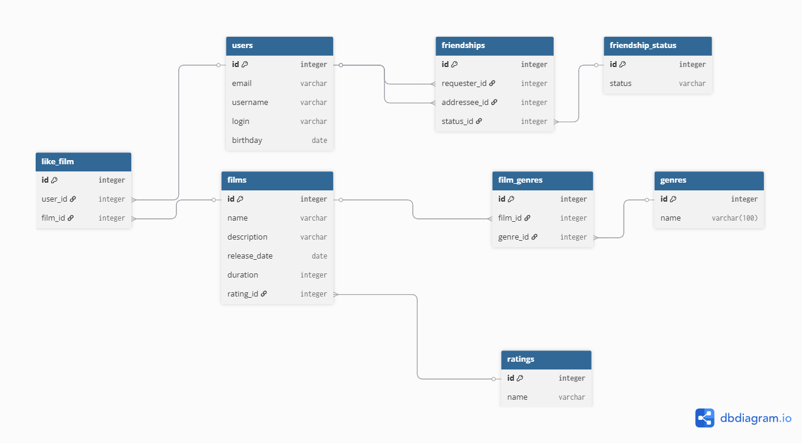

# java-filmorate
# Схема базы данных




## Пояснение к схеме 

В схеме показаны таблицы нашего приложения:
- `users` — пользователи приложения.
- `friendships` — связи дружбы между пользователями.
- `friendship_status` — статус дружбы.
- `films` — фильмы с названием, описанием, датой релиза, продолжительностью и возрастным рейтингом
- `ratings` — возрастные рейтинги фильмов.
- `genres` - жанры фильмов.
- `film_genres` - связь «многие-ко-многим» между фильмами и жанрами.
- `like_film` - лайки пользователей для фильмов.


### Примеры запросов:

1. Получить все фильмы жанра «Комедия»:
```sql
SELECT f.name, f.release_date
FROM films f
JOIN film_genres fg ON f.id = fg.film_id
JOIN genres g ON fg.genre_id = g.id
WHERE g.name = 'Comedy';
```

2. Получить все фильмы с определённым возрастным рейтингом:
```sql
SELECT f.name, f.release_date, r.name AS rating
FROM films f
JOIN ratings r ON f.rating_id = r.id
WHERE r.name = 'PG-13';
```

3. Посчитать количество друзей каждого пользователя:
```sql
SELECT u.username, COUNT(fs.addressee_id) AS total_friends
FROM users u
LEFT JOIN friendships fs ON u.id = fs.requester_id AND fs.status_id = 2
GROUP BY u.id, u.username
ORDER BY total_friends DESC;
```
4. Получить друзей конкретного пользователя (например, user_id = 1), у которых статус «accepted»:
```sql
SELECT u.username
FROM friendships fs
JOIN users u ON fs.addressee_id = u.id
WHERE fs.requester_id = 1 AND fs.status_id = 2;
```
5. Получить всех пользователей, которые поставили лайк конкретному фильму
```sql
SELECT u.username
FROM like_film lf
JOIN users u ON lf.user_id = u.id
WHERE lf.film_id = 10;
```
6. Посчитать количество лайков у каждого фильма:
```sql
SELECT f.name, COUNT(lf.user_id) AS likes_count
FROM films f
LEFT JOIN like_film lf ON f.id = lf.film_id
GROUP BY f.id, f.name
ORDER BY likes_count DESC;
```
7. Получить все жанры конкретного фильма:
```sql
SELECT g.name
FROM film_genres fg
JOIN genres g ON fg.genre_id = g.id
WHERE fg.film_id = 5;
```
8. Получить все фильмы конкретного жанра:
```sql
SELECT f.name
FROM film_genres fg
JOIN films f ON fg.film_id = f.id
WHERE fg.genre_id = 3;
```