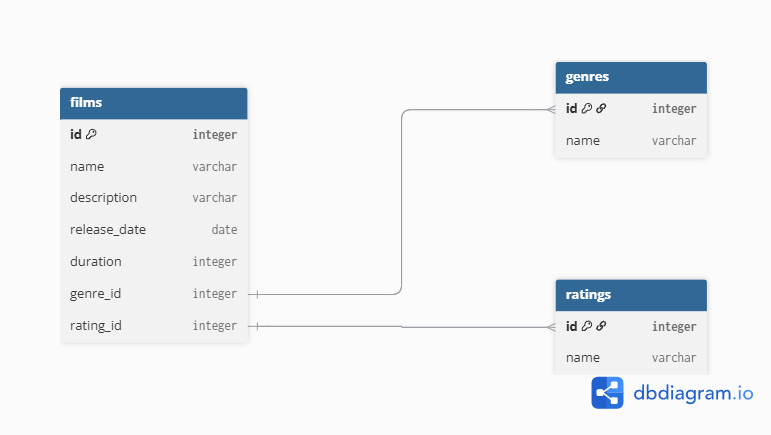
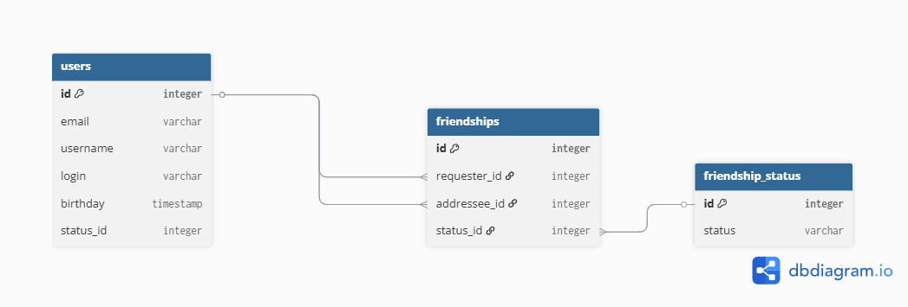

# java-filmorate
# Схема базы данных




## Пояснение к схеме для пользователей

В схеме показаны таблицы нашего приложения:
- `users` — пользователи приложения.
- `friendships` — связи дружбы между пользователями.
- `friendship_status` — статус дружбы.

## Пояснение к схеме для фильмов

В схеме показаны таблицы нашего приложения:
- `films` — фильмы с жанрами и рейтингами.
- `genres` — жанры фильмов.
- `ratings` — возрастные рейтинги фильмов.


### Примеры запросов:

1. Получить все фильмы жанра «Комедия»:
```sql
SELECT f.name, f.release_date
FROM films f
JOIN genres g ON f.genre_id = g.id
WHERE g.name = 'Comedy';
```

2. Получить все фильмы с определённым возрастным рейтингом:
```sql
SELECT f.name, f.release_date, r.name AS rating
FROM films f
JOIN ratings r ON f.rating_id = r.id
WHERE r.name = 'PG-13';
```

3. Посчитать количество друзей каждого пользователя:
```sql
SELECT u.username, COUNT(fs.addressee_id) AS total_friends
FROM users u
LEFT JOIN friendships fs ON u.id = fs.requester_id AND fs.status_id = 2
GROUP BY u.id, u.username
ORDER BY total_friends DESC;
```
4. Получить друзей конкретного пользователя (например, user_id = 1), у которых статус «accepted»:
```sql
SELECT u.username
FROM friendships fs
JOIN users u ON fs.addressee_id = u.id
WHERE fs.requester_id = 1 AND fs.status_id = 2;
```